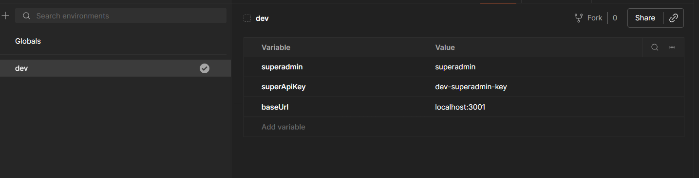
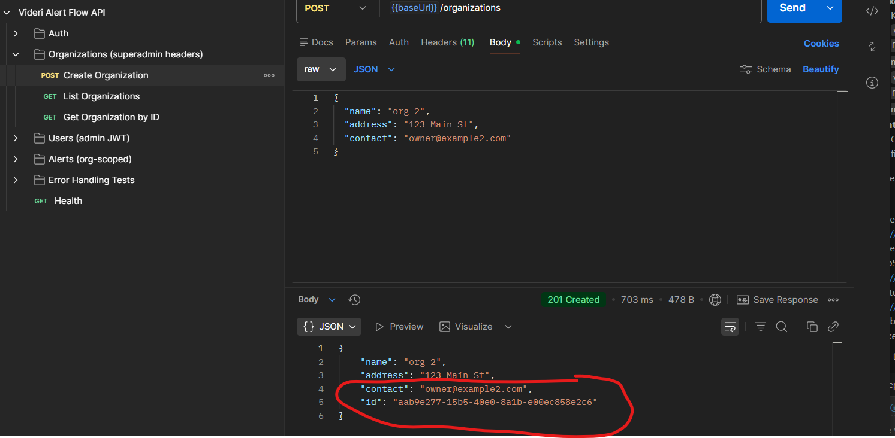
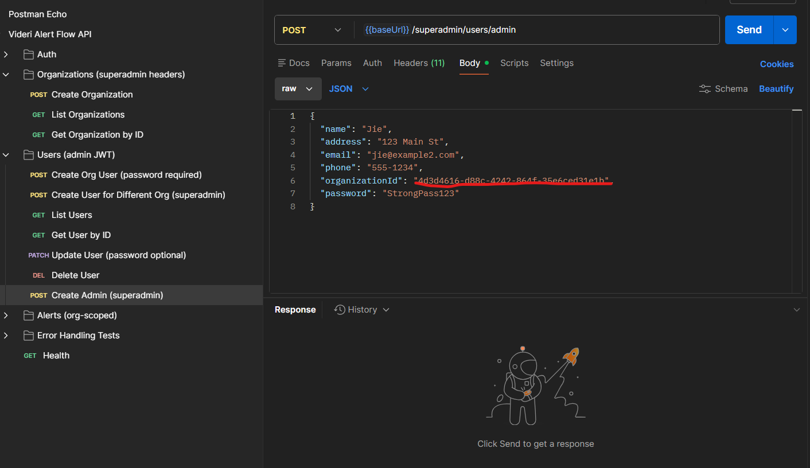
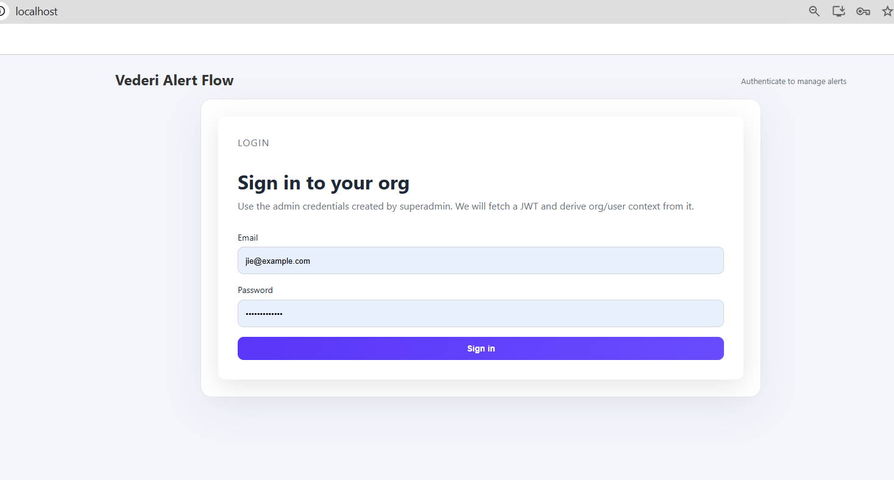
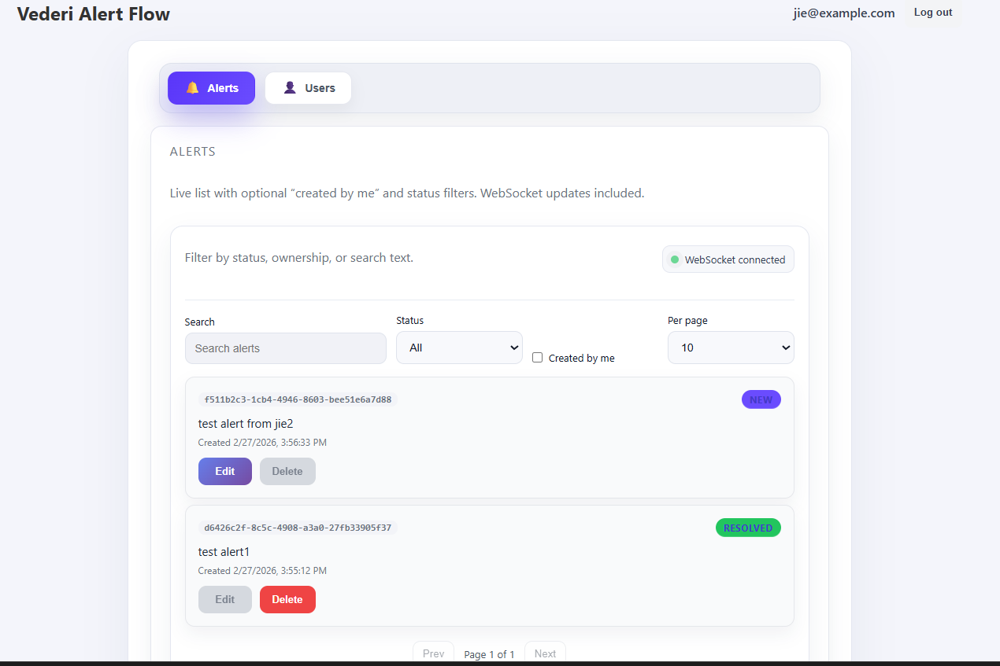
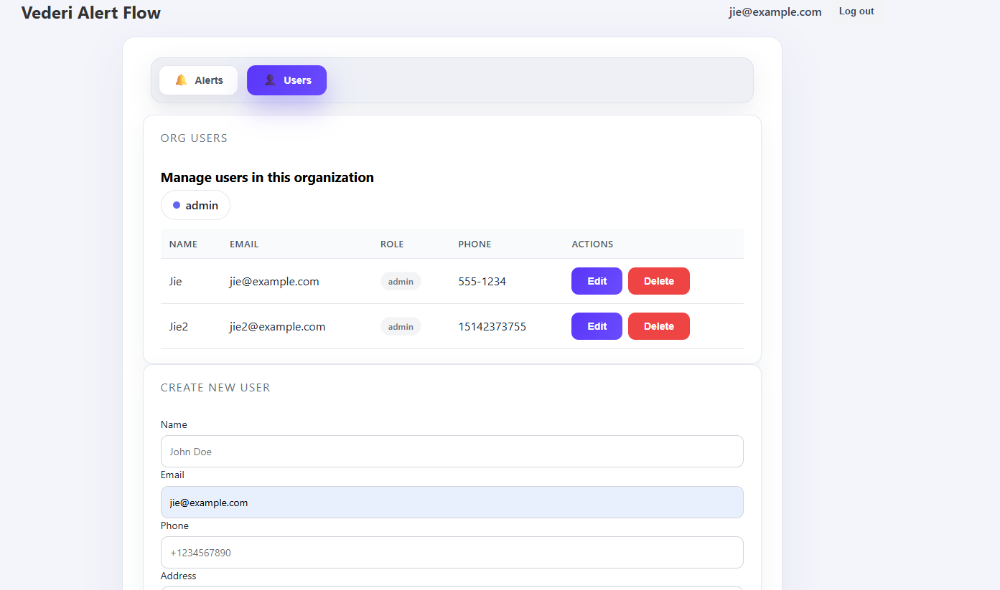

# Videri Alert Flow

Event-driven alert management built with NestJS, React, Kafka, Postgres, and WebSockets. This README now replaces the scattered Markdown docs; everything you need is here.

## Architecture

- **frontend** (`packages/frontend`): React + TypeScript served by Nginx.
- **backend-api** (`packages/backend-api`): REST API, Kafka producer, auth/roles.
- **backend-persistence** (`packages/backend-persistence`): Kafka consumer that persists alert events to Postgres.
- **backend-notification** (`packages/backend-notification`): Kafka consumer + WebSocket server that emits real-time notifications.
- **shared** (`packages/shared`): DTOs, entities, enums shared across services.

Event flow: API writes/updates alerts → publishes to Kafka → persistence consumer stores history → notification consumer pushes real-time events via WebSockets.

## Quickstart

# Videri Alert Flow

Event-driven alert management built with NestJS, React, Kafka, PostgreSQL, and WebSockets. This README consolidates the key developer and operations information.

## Architecture

- **frontend** (`packages/frontend`): React + TypeScript served by Nginx.
- **backend-api** (`packages/backend-api`): REST API, Kafka producer, authentication and role enforcement (port 3001).
- **backend-persistence** (`packages/backend-persistence`): Kafka consumer that persists alert events to Postgres.
- **backend-notification** (`packages/backend-notification`): Kafka consumer + WebSocket server (Socket.IO) that emits real-time notifications (port 3002).
- **shared** (`packages/shared`): DTOs, entities and enums shared across services.

Event flow: API writes/updates alerts → publishes to Kafka (`alert-events`) → persistence consumer stores history → notification consumer pushes real-time events via WebSockets.

## Quickstart

Prerequisites: Docker, Docker Compose, Node.js (recommended 18+), npm.

From the repository root:

```bash
# copy an example env if needed
cp .env.dev.example .env.dev

docker compose --env-file .env.dev up --build
```

Service endpoints (local):

- Frontend: http://localhost
- API: http://localhost:3001
- WebSocket (backend-notification): http://localhost:3002
- Postgres (host): localhost:5438 → container `db:5432`
- Kafka: localhost:9092 → container `kafka:9092`

Stop services:

```bash
docker compose down
```

## Environment

Each package may include `.env.dev` and `.env.prod` files. Compose can read a root `.env.dev`/`.env.prod` via `--env-file`.

Common env vars:

- `DB_HOST`, `DB_PORT`, `DB_USER`, `DB_PASS`, `DB_NAME`
- `KAFKA_BROKER`
- `PORT`, `NODE_ENV`
- Frontend: `REACT_APP_API_URL`, `REACT_APP_WS_URL`

Precedence when running Compose: shell env > service `environment:` > `--env-file` > service `.env`.

## Local Development

- Install all deps: `npm run install:all`
- Build shared package: `npm run build:shared`
- Build all: `npm run build:all`

Run packages individually (from root or inside package):

- API (dev): `npm run dev:api` or `npm run start:dev` in `packages/backend-api`
- Persistence (dev): `npm run dev:persistence`
- Notification (dev): `npm run dev:notification`
- Frontend (dev): `npm run dev:frontend`

Tests:

- Run all tests: `npm test`
- Run frontend tests: `npm run test --workspace=frontend -- --watch=false`

## API & Auth

- Auth: `POST /auth/login` with `email` + `password` → JWT.
- Superadmin-only org management endpoints (use appropriate superadmin headers).
- Admin user management: `/users` CRUD; `password` required on create, optional on update. Role defaults to `user`.
- Superadmins may create users for any organization by including `organizationId` in `POST /users`.
- Alerts: create/list/update/delete under `/alerts`. Statuses: `New`, `Acknowledged`, `Resolved`. Event history: `/alerts/{id}/events`.

Authorization and org scoping are enforced via JWT claims (`orgId`, `userId`).

## Kafka & WebSockets

- Topic: `alert-events`
- Producer: `backend-api`
- Consumers: `backend-persistence` (group `alert-events-persistence-group`), `backend-notification` (group `alert-events-notification-group`)
- WebSocket gateway runs in `backend-notification` (port 3002). Clients join organization rooms and receive events like `newAlert`, `alertStatusUpdate`, and `alertEvent`.

## Project Structure

```
videri-alert-flow/
├─ packages/
│  ├─ shared/                  # DTOs, entities, enums
│  ├─ backend-api/             # REST + Kafka producer (port 3001)
│  ├─ backend-persistence/     # Kafka consumer → Postgres
│  ├─ backend-notification/    # Kafka consumer → WebSocket (port 3002)
│  └─ frontend/                # React app (served by Nginx)
├─ docker-compose.yml
├─ docs/postman/videri-alert-flow.postman_collection.json
└─ README.md
```

## Operations Cheatsheet

- Dev compose: `docker compose --env-file .env.dev up --build`
- Prod-ish compose: `docker compose --env-file .env.prod up --build -d`
- Tail logs: `docker compose logs -f`
- Scale consumers: `docker compose up --scale backend-persistence=3 --scale backend-notification=3`

## Postman Collection

Import the collection at [docs/postman/videri-alert-flow.postman_collection.json](docs/postman/videri-alert-flow.postman_collection.json). It includes env values for base URL, superadmin headers, JWTs, and sample create/update payloads.

Included scopes:

- Health
- Auth
- Organizations (superadmin)
- Users (admin)
- Alerts (lifecycle and error scenarios)
- Error handling tests

## Troubleshooting

- API → DB: confirm `DB_HOST` is reachable (`db` in-compose) or use mapped host port (5438).
- Kafka consumers idle: verify `KAFKA_BROKER` and consumer groups inside the Kafka container.
- WebSocket connectivity: ensure `REACT_APP_WS_URL` matches notification service and check backend-notification logs.

## Contributing

- Use TypeScript style across packages; run lint/format before opening PRs.
- Prefer conventional commits (`feat`, `fix`, `docs`, etc.).
- Update `packages/shared/src/index.ts` for shared exports and rebuild shared before dependent packages.

## Quick Demo

1. Start the stack and import the Postman collection from `docs/postman/videri-alert-flow.postman_collection.json`.
2. Create a dev environment in Postman (if not present) and set the base URL and JWT placeholders.
3. Create an organization (copy UUID) and create an Admin user for that org via the Superadmin requests.
4. Login as the Admin and exercise Alerts and Users requests; watch real-time updates via the frontend connected to the notification service.







